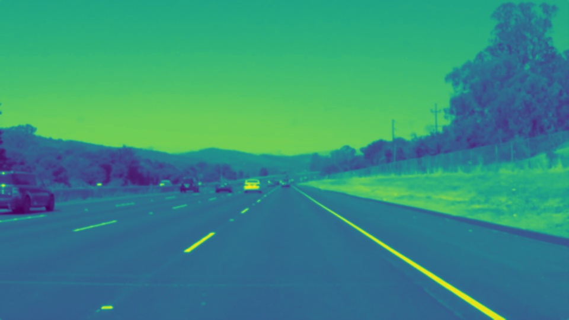
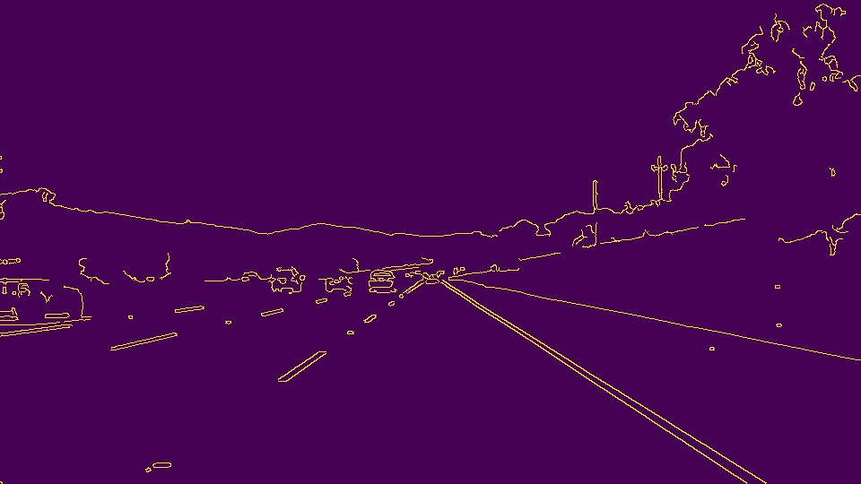
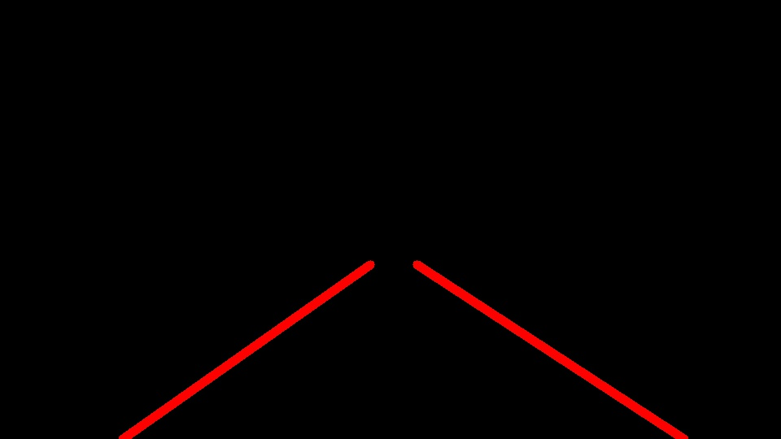
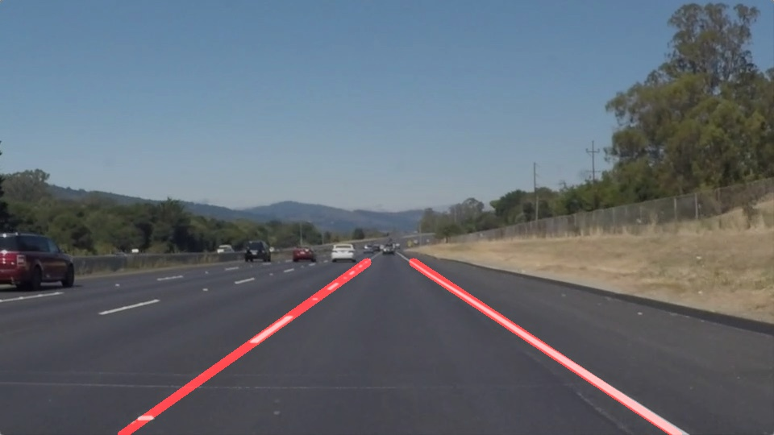

**Finding Lane Lines on the Road**

The goals / steps of this project are the following:
* Make a pipeline that finds lane lines on the road
* Reflect on your work in a written report

[//]: # (Image References)

[image1]: ./examples/grayscale.jpg "Grayscale"

---

### Reflection

### 1. Describe your pipeline. As part of the description, explain how you modified the draw_lines() function.

I constructed a single frame lane line image overlay function, `create_overlay_with_lane_lines`, which executes a series of steps to accomplish its goal. The input to the function is an image, the output being a copy of the input image image with red lane lines overlayed on it. Both the input and ouput are single `numpy.array`s with elements representing RGB-colored pixels.

#### Steps

1. Convert the original image to grayscale.
1. Apply a Gaussian blur to the grayscale image,  using a blur kernel size of five pixels.
1. Detect edges in the Gaussian-blurred image using Canny edge detection, with a low threshold of fifty pixels and high threshold of one-hundred fifty pixels.
1. Create a trapezoidal image mask, encompassing the two lane lines in which the vehicle is travelling and extending approximately to the horizon of the lane.
1. Create a copy of the Canny-edge-detected image, including only the pixels in the mask from the previous step.
1. Apply a Hough transformation on the masked Canny-edge-detected image, using rho=2, theta=1 degree, Hough threshold=15, minimum line length=60 pixels and maximum line gap=30 pixels.
1. Use the Hough transformation lines to draw lane lines onto a blank black canvas (`draw_lines()`)
   1. Group the lines by the sign of their slope.
   1. In each group:
      1. Remove lines with zero or infinite slope.
      1. Compute the slope and y-intercept for each line.
      1. Remove lines whose slope is more than two standard deviations away from the median.
      1. Average slopes and intercepts of remaining lines.
      1. Draw the line with average slope and intercept onto the blank black canvas, using the bounding box of the mask.
1. Overlay the black canvas (now including lane lines) onto a copy of the original image.
1. Return the new image with lane lines drawn.

Some example images after each stage in the pipeline:

### Original Image

### Grayscale (shows as monochrome here)

### Blurred Grayscale (shows as monochrome here)

### Canny edge detected

### Masked

### Hough Lines

### Final image

Arriving at the series of steps in this pipeline was trivial given the examples provided in Lesson 1. However, the parameters for the Canny-edge detection, Hough transformation, and line averaging functions required experimentation to arrive a satisfactory final output. I started by modifying the Canny-edge detection and Hough transformtion parameters from those that I found sufficient in the Lesson 1 tutorials. In particular, I needed to increase the Canny low threshold for pixels, as well as increase the minimum line length and maximum line gap in the Hough line finding transformation, in order to improve recall of the line segments and improve the precision of the lines (eliminate outliers and lines not corresponding to lane lines).

Once I felt that I had tuned the line detection to my satisfaction, I moved onto the `draw_lines` function. I tried a handful of approaches for creating single, bold lines for the vehicle lane lines. In each experiment, I first grouped the lines by the sign of their slopes, then in each group, removed lines with zero or infinite slope. Then, each experiment has a different approach to combining the individual lines in each group into a single line.

Experiments tried:
* Computing slopes and intercepts for all lines, averaging slopes and intercepts, and drawing the line with the average slope and intercept
* Same as above, but filtering out lines whose slope is more than two standard deviations away from the median
* Computing midpoints for each line, then computing the linear regression with the midpoints, and drawing the regression line
* Using an [`EllipticEnvelope`](http://scikit-learn.org/stable/modules/generated/sklearn.covariance.EllipticEnvelope.html) for outlier detection among all points of the lines, filtering outliers, then computing the linear regression with the remaining points and drawing the regression line

Of the four experiments attempted, the second (computing slopes and intercepts for all lines, averaging slopes and intercepts, filtering out lines whose slope is more than two standard deviations away from the median, then drawing the line with the average slope and intercept) yielded the best performance (two lines properly covering the vehicle lane lines with minimum errors). All four experiments exist in code for review.

### 2. Identify potential shortcomings with your current pipeline

While the current pipeline draws averaged lines well, the lines are "shaky" in videos - they're not as smooth as [the video example](examples/P1_example.mp4) provided. Additionally, the lines drawn by the pipeline don't track the lines quite as closely as the examples provided. Furthermore, the pipeline does NOT work on [the challenge video](test_videos/challenge.mp4) - [the lines drawn by my pipeline](test_videos_output/challenge.mp4) do not track the lane lines.

Other shortcomings which would be revealed with other examples:
* Different image / video dimensions and DPI would affect results due to hardcoded margins for the region of interest mask.
* Different camera angles (not straight on, pointed higher or lower) would affect results for the same reason.
* Poor lighting conditions have not been tested; the pipeline may not work at night
* Curved lane lines or lines which are not straight for a minimum distance would affect results (as in the challenge video).
* Different colors of pavement or lane lines would affect results.

### 3. Suggest possible improvements to your pipeline

To improve upon the shortcomings above, I could:

* In each frame of video with lanes drawn, look at lane lines drawn in previous frames and only moving the drawn lines some small amount in the direction of the new lines. This should reduce the "shakiness" of the drawn lines in the video.
* Running Hough transform with multiple regions of interest per frame in an attempt to find lines which have more similar slopes (indicating less outliers were detected)
* Detecting daylight vs nighttime via some method, which could be used to use different parameters in Canny edge detection for better recall and performance in edges.
